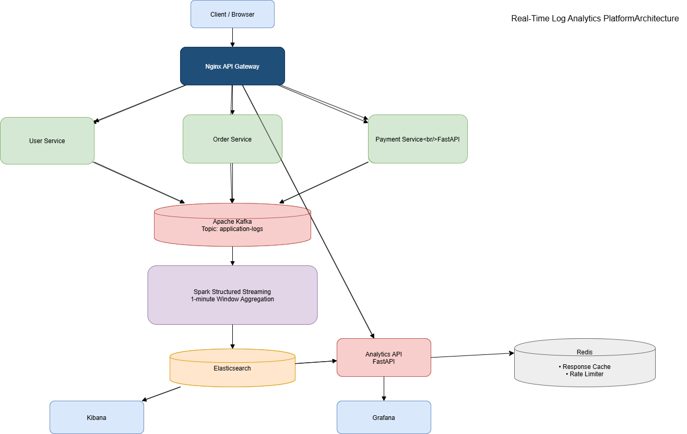
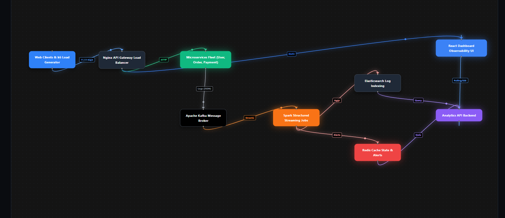
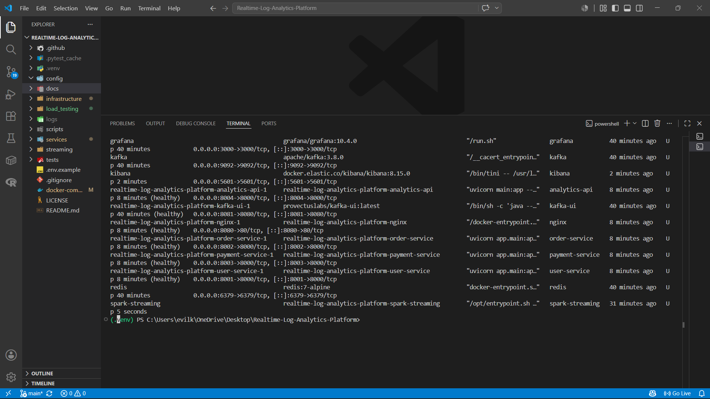
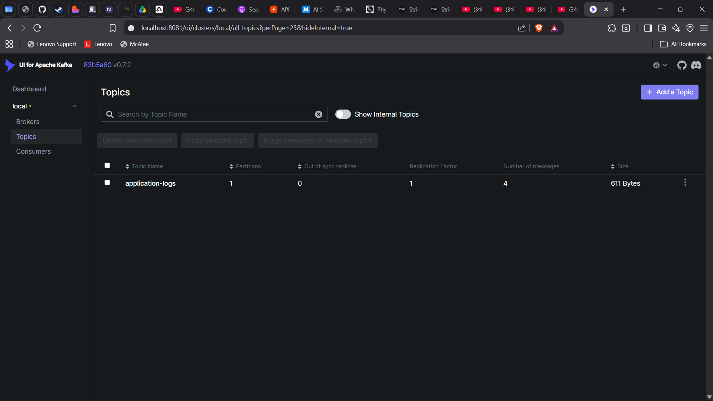
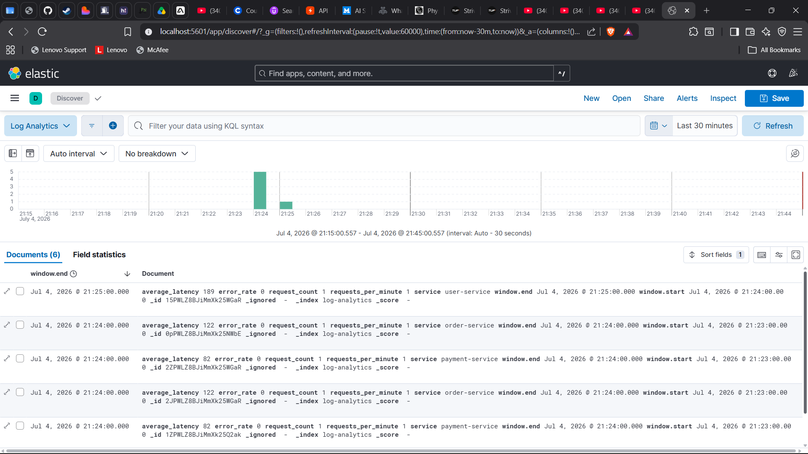
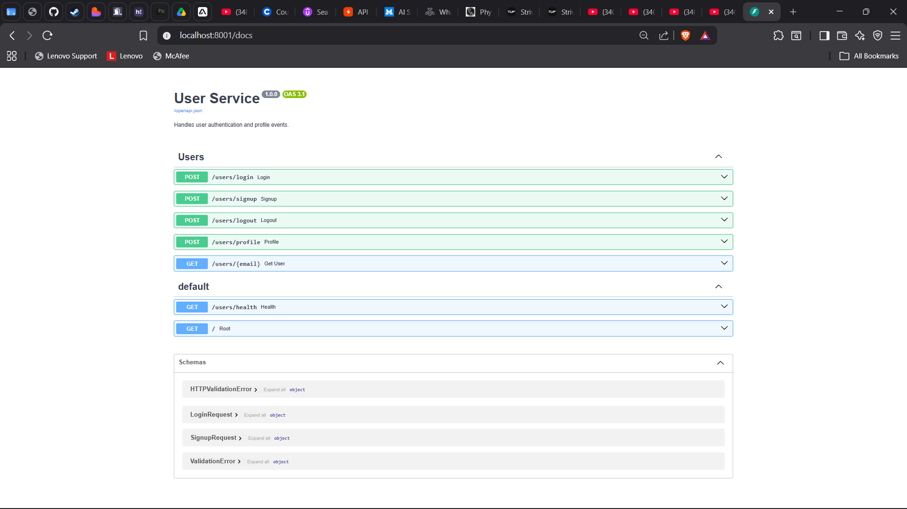
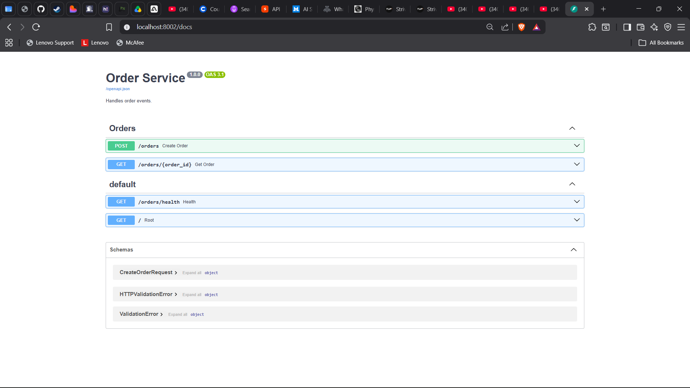
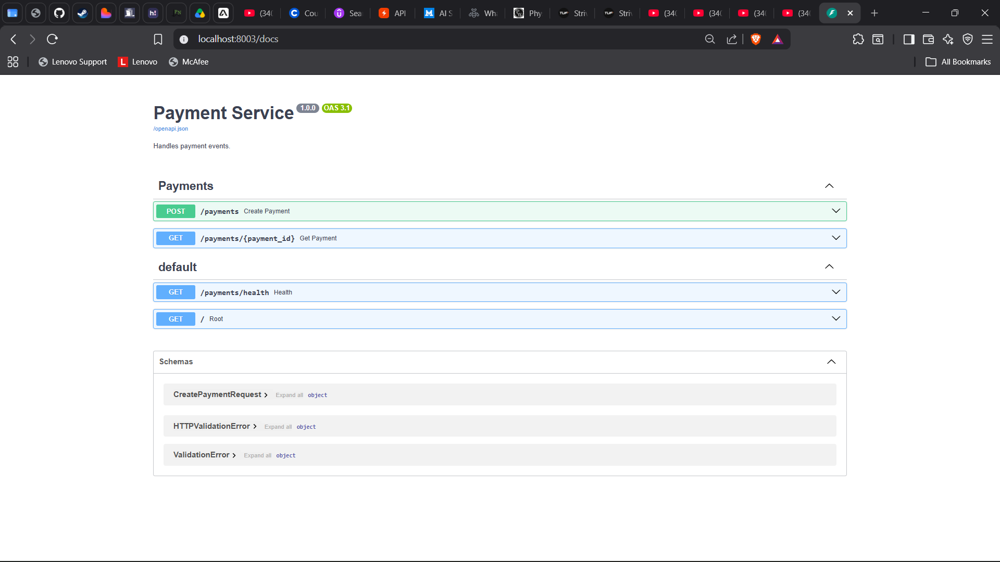
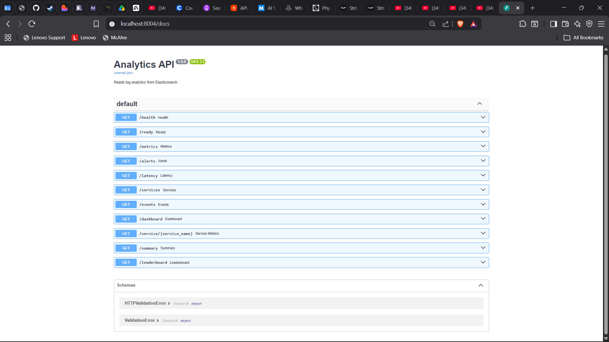

# Real-Time Distributed Observability Platform

[](https://www.docker.com/)
[](https://www.python.org/)
[](https://fastapi.tiangolo.com/)
[](https://kafka.apache.org/)
[](https://www.elastic.co/)
[](LICENSE)

A production-inspired distributed observability platform built with FastAPI, Apache Kafka, Spark Structured Streaming, Elasticsearch, Redis, and React. Implements the complete telemetry pipeline — from log generation to real-time visualization.


---

## Executive Summary

**What problem this solves:**
Modern distributed applications generate enormous telemetry across multiple services. Correlating these events to diagnose failures, track latency percentiles, and understand request flow is genuinely hard. Commercial tools (Datadog, New Relic) abstract this away.

**Why I built it:**
To understand and implement the complete observability pipeline from scratch — log generation, message streaming, real-time aggregation, distributed indexing, and live visualization — rather than consuming an existing managed service.

**Key capabilities:**
- Real-time P50/P90/P95/P99 latency computed via Spark sliding windows
- Event-driven telemetry pipeline with Kafka as a durable buffer
- Custom React dashboard with auto-refreshing time-series charts
- Live log streaming with full-text search across Elasticsearch
- Single `docker compose up` deploys the entire 11-container platform

---

## Features

- **Event-Driven Telemetry:** Microservices publish structured JSON logs to Kafka asynchronously — no blocking on analytics writes
- **Stream Processing:** Spark Structured Streaming computes rolling window aggregations continuously
- **Service Health Monitoring:** Per-service dashboards with isolated latency, RPS, and error metrics
- **Live Log Streaming:** Real-time log tail with search, severity filters, and service filters
- **Historical Analytics:** Time-series charts for endpoint comparison, traffic distribution, and error trends
- **Infrastructure Monitoring:** Grafana for container-level metrics; Kibana for raw index exploration
- **Load Generator:** CLI tool for simulating Light / Medium / Heavy / Custom traffic profiles
- **Fully Containerized:** Complete stack orchestrated via Docker Compose — one command to run

---

## Architecture

The platform separates request handling, event processing, analytics, and visualization into independent layers connected by well-defined interfaces.

### Component Architecture



### Request Flow

Every HTTP request generates an asynchronous telemetry event that flows independently through the analytics pipeline — the client response is never blocked by monitoring.



📖 [Deep-dive: System Architecture](docs/01-system-architecture.md)

---

## Technology Stack

| Layer | Technology | Version | Purpose |
|-------|-----------|---------|---------|
| API Gateway | Nginx | Alpine | Reverse proxy, request routing, SPA serving |
| Microservices | FastAPI + Python | 0.110 / 3.11 | Business logic, structured log generation |
| Event Bus | Apache Kafka | 3.8.0 | Durable async telemetry streaming |
| Stream Processing | Spark Structured Streaming | 3.5 | Rolling window aggregations (P95, RPS, errors) |
| Storage & Search | Elasticsearch | 8.15.0 | Full-text log search, time-series metrics |
| Cache | Redis | 7-alpine | Fast metric retrieval, repeated query reduction |
| Frontend | React + TypeScript + Tailwind | 18 | Interactive live dashboard |
| Charts | Recharts | — | Time-series and distribution visualizations |
| Infrastructure Monitoring | Grafana | 10.4.0 | Container-level metrics |
| Log Exploration | Kibana | 8.15.0 | Raw Elasticsearch index exploration |
| Containerization | Docker Compose | — | Full-stack local and cloud orchestration |

---

## Dashboard

### System Overview
The operational control center. Displays global KPIs (throughput, error rate, avg latency), service health cards, cluster status, and a recent events feed.


---

### Analytics Dashboard
Historical trend analysis. Stacked area charts for cross-service traffic comparison, latency distribution histograms, and endpoint-level statistics.


---

### Service Monitoring
Isolated per-service dashboards for User, Order, and Payment services. Shows request volume, latency trends, and error statistics scoped to the selected service.


---

### Distributed Trace Explorer
Trace individual requests across service boundaries using `request_id` propagation. Correlates events from Nginx through FastAPI to the Kafka event and Elasticsearch index.


---

### Log Explorer
Live log tail backed by Elasticsearch. Supports full-text search, severity filters (INFO/WARN/ERROR), and service-specific filtering.


---

### Alerts
Threshold-based alert monitoring. Surfaces services that exceed configured error rate or latency limits, pulling directly from Elasticsearch aggregations.


📖 [Deep-dive: Dashboard Guide](docs/03-dashboard-guide.md)

---

## Infrastructure

### Docker Services
All 11 containers orchestrated via Docker Compose on a shared bridge network. Startup order enforced via `depends_on` health checks.



---

### Kafka Topics
Real-time Kafka topic inspection via Kafka UI. Shows message rate, consumer group offsets, and partition distribution.



---

### Kibana — Discover
Raw Elasticsearch index exploration. Used for ad-hoc log searches, schema inspection, and root cause analysis.



---

### Kibana — Dashboard
Pre-built Kibana dashboards showing log volume, error trends, and service-level breakdowns directly from Elasticsearch indices.


---

### Grafana — Infrastructure Metrics
Container-level monitoring — CPU, memory, and network I/O per service. Complements the application-level metrics in the React dashboard.


📖 [Deep-dive: Deployment Guide](docs/06-deployment-guide.md)

---

## API Documentation

All services expose interactive Swagger UI at `/docs`. No external API client needed.

### User Service API



---

### Order Service API



---

### Payment Service API



---

### Analytics API



📖 [Deep-dive: API Reference](docs/04-api-reference.md)

---

## Performance Testing

Load generated with k6 via Docker. Medium profile: 20 virtual users, 2-minute duration.


| Metric | Result |
|--------|--------|
| Virtual Users | 20 |
| Total Requests | 4,623 |
| Throughput | 38 req/sec |
| P95 Latency | 42 ms |
| Average Latency | 18 ms |

```bash
# Reproduce this test
python scripts/generate_load.py --profile medium
```

📖 [Deep-dive: Performance Testing](docs/08-performance-testing.md)

---

## Load Generator

| Profile | Command | Expected RPS | Best For |
|---------|---------|-------------|----------|
| Light | `--profile light` | 20–50 RPS | Quick pipeline verification |
| Medium | `--profile medium` | ~38 RPS | Interview / demo walkthroughs |
| Heavy | `--profile heavy` | 500+ RPS | Stress testing Spark pipeline |
| Custom | `--rps N --concurrency N --duration Ns` | User-defined | Targeted edge case testing |

---

## Repository Structure

```
.
├── dashboard/              # React + TypeScript SPA
│   └── src/
│       ├── pages/          # One file per dashboard page
│       └── hooks/          # Data-fetching hooks (useMetrics, useLogs)
├── services/               # FastAPI microservices
│   ├── user-service/
│   ├── order-service/
│   └── payment-service/
├── streaming/              # Spark Structured Streaming PySpark jobs
├── infrastructure/         # Nginx gateway configuration
├── scripts/                # Developer utilities
│   └── generate_load.py    # Load generator CLI
├── load_tests/             # Raw k6 JS scenarios
├── docs/
│   └── images/             # All screenshots and diagrams
├── config/                 # Shared environment definitions
└── docker-compose.yml      # Orchestrates all 11 containers
```

📖 [Deep-dive: Project Structure](docs/05-project-structure.md)

---

## Local Setup

### System Requirements

| | Minimum | Recommended |
|--|---------|-------------|
| RAM | 8 GB | 16 GB |
| CPU | 4 cores | 8 cores |
| Software | Docker Desktop, Python 3.11 | — |

### Installation

```bash
git clone https://github.com/your-org/realtime-log-analytics-platform.git
cd realtime-log-analytics-platform
cp .env.example .env
docker compose up -d --build
docker compose ps
```

### Service URLs

| Service | URL | Credentials |
|---------|-----|-------------|
| React Dashboard | http://localhost:3000 | — |
| API Gateway | http://localhost:8000 | — |
| Grafana | http://localhost:3001 | admin / admin |
| Kibana | http://localhost:5601 | — |
| Kafka UI | http://localhost:8081 | — |

---

## AWS Deployment

1. **Provision:** `t3.xlarge` or larger
2. **Install Docker:** `sudo apt-get install -y docker.io docker-compose-plugin`
3. **Clone and start:** `docker compose up -d --build`
4. **Open ports:** `3000`, `8000`, `3001`, `5601`, `8081`

📖 [Deep-dive: Deployment Guide](docs/06-deployment-guide.md)

---

## Engineering Decisions

| Decision | Reason |
|----------|--------|
| Kafka over RabbitMQ | Log-based, replayable — matches production telemetry architecture |
| Spark over Flink | Mature PySpark ecosystem; micro-batch latency acceptable for 5s polling |
| Elasticsearch over PostgreSQL | Inverted index for full-text trace search; native time-series aggregations |
| HTTP Polling over WebSockets | Simpler to scale and cache for aggregated metrics updated every 5 seconds |
| FastAPI over Flask | Native asyncio support required for non-blocking Kafka producers |
| Docker Compose over K8s | Single-host reproducibility; architecture scales to Kubernetes when needed |

📖 [Deep-dive: Engineering Decisions](docs/07-engineering-decisions.md)

---

## Current Limitations

- **Single Kafka broker** — no replication or partition redundancy
- **Single Elasticsearch node** — no clustering or Index Lifecycle Management
- **No authentication** — all internal APIs are unauthenticated
- **No TLS** — internal service communication is unencrypted
- **Static service discovery** — hostnames hardcoded via Docker DNS

---

## Future Work

- [ ] Distributed tracing via OpenTelemetry SDK
- [ ] Alert manager with configurable threshold rules
- [ ] Kubernetes deployment with Helm Charts
- [ ] Migrate to managed AWS services (MSK, OpenSearch, ElastiCache)
- [ ] GitHub Actions CI/CD pipeline with ECR image publishing
- [ ] Kafka KRaft mode (eliminate Zookeeper dependency)

📖 [Deep-dive: Future Roadmap](docs/09-future-roadmap.md)

---

## Documentation

| Document | Description |
|----------|-------------|
| [01 — System Architecture](docs/01-system-architecture.md) | Component breakdown, communication patterns, trade-offs |
| [02 — Request Lifecycle](docs/02-request-lifecycle.md) | Step-by-step trace of one request through the full pipeline |
| [03 — Dashboard Guide](docs/03-dashboard-guide.md) | Every page, chart, and widget explained |
| [04 — API Reference](docs/04-api-reference.md) | REST endpoints, request/response schemas, status codes |
| [05 — Project Structure](docs/05-project-structure.md) | Folder responsibilities and key files |
| [06 — Deployment Guide](docs/06-deployment-guide.md) | Docker Compose, networking, volumes, AWS EC2 |
| [07 — Engineering Decisions](docs/07-engineering-decisions.md) | Why each technology was chosen and what was rejected |
| [08 — Performance Testing](docs/08-performance-testing.md) | Load profiles, expected observations, demo walkthrough |
| [09 — Future Roadmap](docs/09-future-roadmap.md) | Phased improvement plan |
| [10 — Lessons Learned](docs/10-lessons-learned.md) | Challenges, insights, and reflections |

---

## Live Demo


---

## License

MIT License — see [LICENSE](LICENSE) for details.