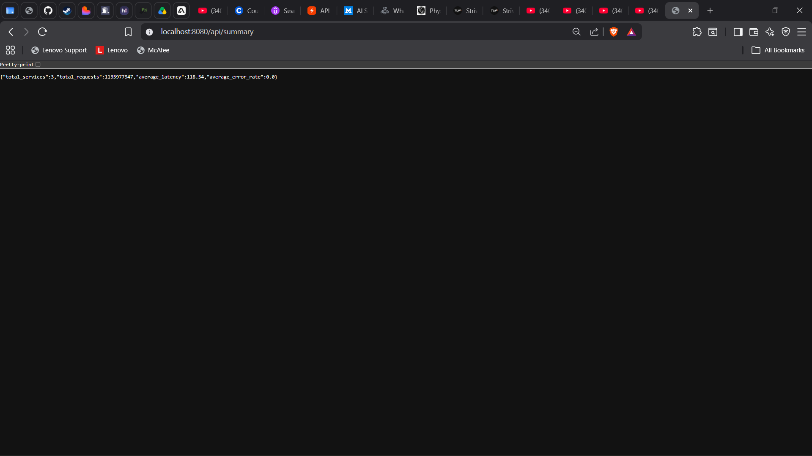

# System Architecture

## Overview


The platform follows an event-driven microservices architecture. The key design decision is that **request handling and telemetry processing are two completely separate paths**. A FastAPI service handles a client request and returns a response. Independently and asynchronously, it publishes a structured event to Kafka. The analytics pipeline picks that event up and processes it without ever touching the request path again.

This separation is what makes the system scalable — observability infrastructure cannot slow down or break the business services.

---

## Full Architecture Diagram

```
                              Users / Load Generator
                                       │
                                       ▼
                              ┌─────────────────┐
                              │  Nginx Gateway  │  ← Port 8000 (public)
                              └────────┬────────┘
                                       │
               ┌───────────────────────┼───────────────────────┐
               │                       │                       │
               ▼                       ▼                       ▼
    ┌─────────────────┐   ┌─────────────────┐   ┌─────────────────┐
    │  User Service   │   │  Order Service  │   │ Payment Service │
    │   FastAPI       │   │   FastAPI       │   │   FastAPI       │
    └────────┬────────┘   └────────┬────────┘   └────────┬────────┘
             │                     │                     │
             └─────────────────────┼─────────────────────┘
                                   │ (async JSON telemetry)
                                   ▼
                          ┌─────────────────┐
                          │  Apache Kafka   │  ← Internal port 9092
                          └────────┬────────┘
                                   │
                                   ▼
                    ┌──────────────────────────┐
                    │  Spark Structured        │
                    │  Streaming (PySpark)     │
                    └──────────┬───────────────┘
                               │
               ┌───────────────┴───────────────┐
               ▼                               ▼
    ┌─────────────────┐             ┌─────────────────┐
    │  Elasticsearch  │             │     Redis       │
    │  (logs + agg.)  │             │  (fast cache)   │
    └────────┬────────┘             └────────┬────────┘
             │                               │
             └───────────────┬───────────────┘
                             ▼
                   ┌──────────────────┐
                   │  Analytics API   │  ← FastAPI, Port 8004
                   └────────┬─────────┘
                            │
                            ▼
                   ┌──────────────────┐
                   │  React Dashboard │  ← Port 3000
                   └──────────────────┘
```

Additionally:
- **Grafana** (Port 3001) — queries container metrics
- **Kibana** (Port 5601) — directly explores Elasticsearch indices
- **Kafka UI** (Port 8081) — inspects Kafka topics and consumer groups

---

## Component Responsibilities

### Nginx
Routes incoming traffic. All microservices are private inside the Docker network. Only Nginx exposes a public port. Serves the React SPA as static assets. Configuration in `infrastructure/nginx/`.




### FastAPI Microservices
Three independent services — User, Order, Payment — each on its own container. After executing business logic, each service fires a structured JSON event to Kafka via an async producer. The HTTP response is returned before Kafka acknowledgement, so monitoring writes are always non-blocking.

### Apache Kafka
Receives all telemetry from the three microservices and stores it durably. Kafka's partitioned log model allows Spark to consume at its own pace independently of how fast services are producing. If Spark goes down, no events are lost — they remain in Kafka until Spark resumes.

### Spark Structured Streaming
The only consumer of Kafka topics. Runs a continuous micro-batch job that parses events, applies time-window aggregations (tumbling windows), computes latency percentiles, and writes the results to Elasticsearch. Spark is the analytical brain between raw telemetry and queryable metrics.

### Elasticsearch
Stores two types of data:
1. **Raw logs** — individual telemetry events (endpoint, status, latency, service, timestamp)
2. **Aggregated metrics** — pre-computed windows from Spark (P95, RPS, error rate per service)

The Analytics API queries both. Raw logs power the Logs page; aggregations power Metrics and Analytics.

### Redis
Caches frequently-requested Analytics API responses. Dashboard polling every 5 seconds would be expensive against Elasticsearch for aggregate queries. Redis reduces this to in-memory lookups.

### Analytics API
A dedicated FastAPI backend that sits in front of Elasticsearch and Redis. The React Dashboard never queries Elasticsearch directly. This decoupling means the storage layer can be swapped (e.g., to OpenSearch on AWS) without changing the frontend.

### React Dashboard
A single-page application served by Nginx. Polls the Analytics API on a 5-second interval using `setInterval` hooks. Charts are rendered with Recharts. No live websocket connections — polling is simpler to scale and easier to reason about.

---

## Docker Compose Topology


All services run on a shared Docker bridge network (`observability-net`). Internal service discovery uses Docker's built-in DNS — containers reference each other by service name (e.g., `kafka:9092`, `elasticsearch:9200`). This means the services are not reachable from outside the Docker network unless explicitly port-mapped.

---

## Architectural Trade-offs

| Decision | Benefit | Cost |
|----------|---------|------|
| Kafka between services and Spark | Decoupling, replay, fault tolerance | Additional JVM, memory overhead |
| Spark micro-batch over Flink | Simpler PySpark API, mature ecosystem | Not true streaming; 1–3s latency floor |
| Polling over WebSockets | No long-lived connection state, cache-friendly | Maximum 5s staleness on dashboard |
| Single Elasticsearch node | Simple setup | No HA, no ILM; single point of failure |
| Analytics API over direct ES queries | Decoupled frontend from storage | Extra hop in the request chain |

---

## Intentional Simplifications

These are **known limitations** that would be addressed in a production deployment:

- **Single Kafka broker** — no replication factor, no multi-broker failover
- **No mTLS** — internal service traffic is unencrypted
- **No authentication** — Analytics API is open
- **Static service discovery** — Docker DNS, no Consul or service mesh
- **No distributed tracing** — custom `trace_id` propagation only
- **No alert manager** — no threshold-based alerting or notification routing

The simplifications are intentional to keep the platform runnable on a developer workstation. The architecture itself is sound and extends to production with the additions described in [09-future-roadmap.md](09-future-roadmap.md).
