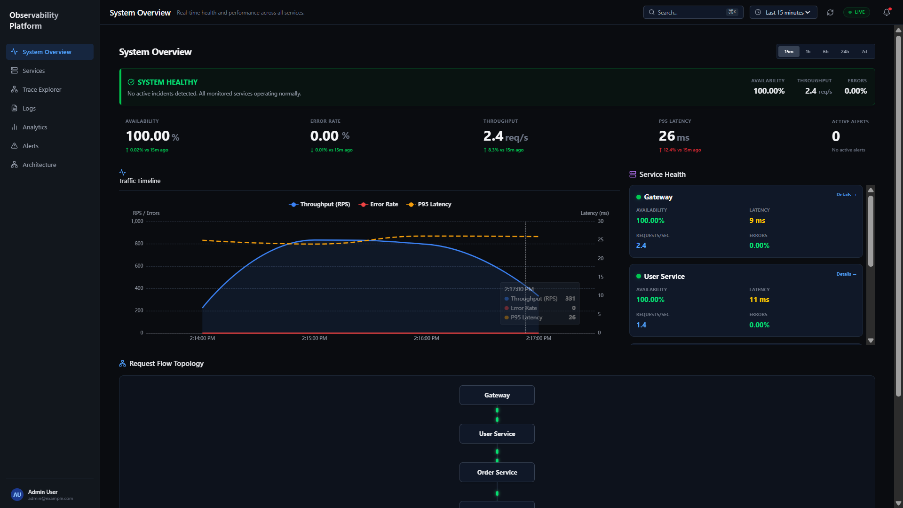
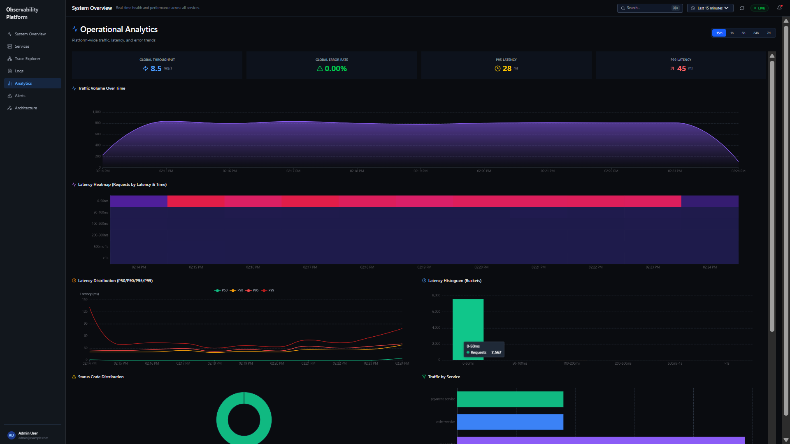
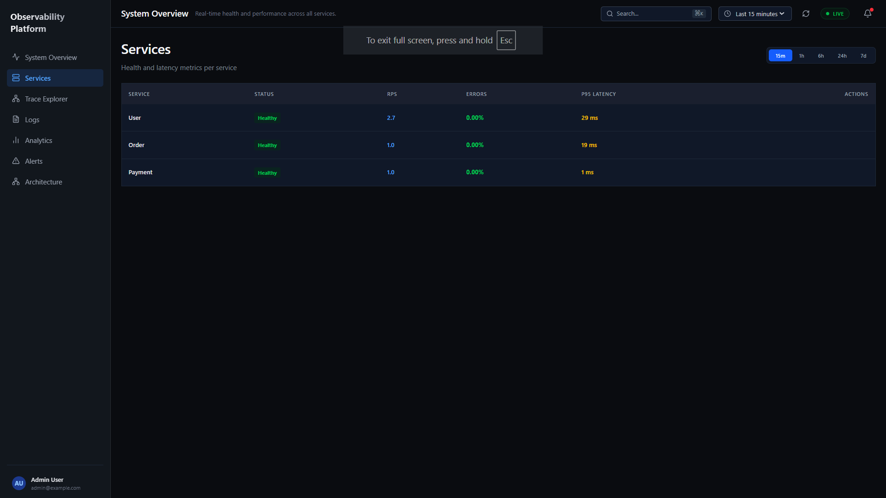
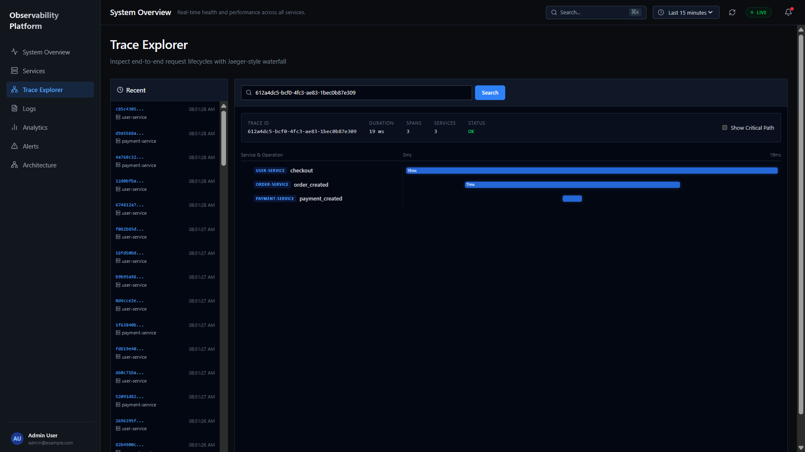
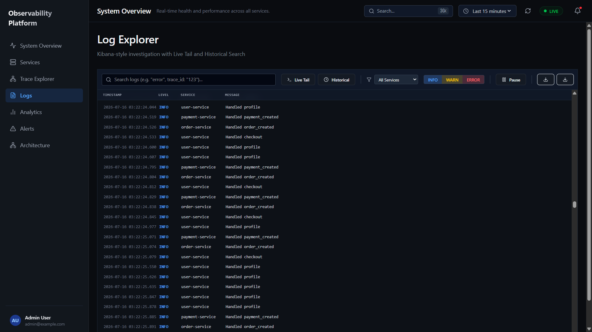
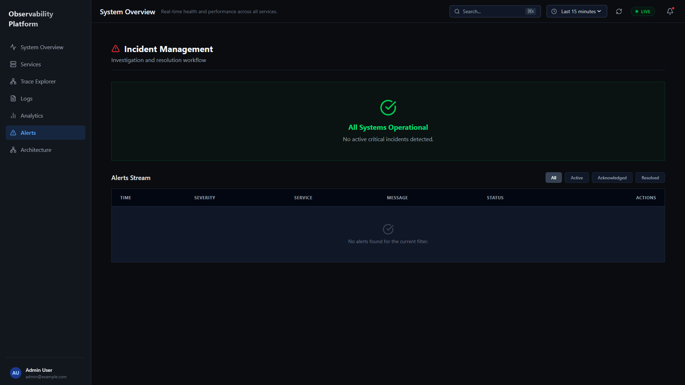

# Dashboard Guide

The React Dashboard provides operational visibility into the entire observability pipeline. Every page is built around a specific operational question — not just a collection of charts.

Data source: all pages query the Analytics API (`/api/*`), which queries Elasticsearch and Redis. The dashboard contains no business logic.

Refresh strategy: all pages poll on a 5-second interval via `setInterval` React hooks. Charts update incrementally — new data points are appended to existing series without full page reloads.

---

## Overview Page

**Operational question:** *Is the platform healthy right now?*

This is the entry point for any demonstration or incident response. It aggregates data from multiple endpoints into a single view.

### KPI Cards (top row)
Four cards showing platform-wide aggregates for the selected time range:
- **Total Requests** — cumulative request count across all services
- **Throughput** — current requests per second (RPS)
- **Avg Latency** — average response time in milliseconds
- **Error Rate** — percentage of 4xx + 5xx responses

### Service Health Cards
One card per microservice (User, Order, Payment). Each card shows:
- Service name and status indicator (healthy / degraded / down)
- Current RPS for that service
- P95 latency for that service
- Recent error count

Status is computed from Elasticsearch metrics: a service is flagged "degraded" if error rate > 2% or P95 latency > 500ms within the last 5 minutes.

### Cluster Status Panel
Shows the state of the infrastructure components:
- Kafka (topic count, message rate)
- Elasticsearch (index count, document count)
- Spark (streaming job status)
- Redis (hit/miss ratio)

### Recent Events Feed
A timestamped list of significant events pulled from Elasticsearch, filtered to `level: WARN` or `level: ERROR`. Acts as a quick-scan alternative to the full Logs page.

---

## Analytics Dashboard

**Operational question:** *What trends existed over the last hour / day?*

### Traffic Distribution Chart
A stacked area chart showing request volume per service over time. Makes it easy to see which services absorb the most traffic and whether the distribution shifts.

### Endpoint Statistics Table
Ranks all endpoints by request count, average latency, and error rate. Identifies the slowest or most error-prone endpoints. Useful for optimization decisions.

### Status Code Distribution (Pie Chart)
Breaks down HTTP response codes across all services. A healthy system should show predominantly 2xx. Growing 5xx slices indicate backend failures; growing 4xx suggests client-side issues.

### Latency Trend (per endpoint)
A line chart that isolates a single endpoint across the time range. Reveals if a specific endpoint is degrading over time independent of overall traffic volume.

---

## Service Monitoring

**Operational question:** *Is this specific service healthy since the last deployment?*

### Service Selector
Tabs for User Service, Order Service, Payment Service. Selecting a tab scopes all charts below to that service only.

### Service Health Summary
- Current status (healthy / degraded / down)
- Uptime in the selected time range
- Total request count and error count

### Latency Chart
A time-series chart showing P50, P95, P99 for this service only. Independent of overall platform load — useful for identifying if a specific service is degrading while others are not.

### Top Endpoints Table
Ranks endpoints within this service by request count, latency, and error rate. The most actionable view for service owners optimizing their API.

---

## Distributed Trace Explorer

**Operational question:** *What exactly happened during this specific request?*

Trace individual requests across service boundaries using `request_id` propagation. Each request generates a structured telemetry event containing the `request_id`, which flows from Nginx → FastAPI → Kafka → Spark → Elasticsearch.

### How to Use
1. Copy a `request_id` from the Log Explorer
2. Paste it into the Trace Explorer search box
3. See the full event timeline: route matched, service handling, latency breakdown, response status

---

## Log Explorer

**Operational question:** *What exactly happened in this time window or for this endpoint?*

### Live Log Stream
An auto-scrolling table of recent telemetry events from Elasticsearch, sorted by descending timestamp. Each row shows: timestamp, service, endpoint, status code, latency, and message. Updates every 2 seconds.

### Search Box
Full-text search backed by Elasticsearch. Queries the `message` and `endpoint` fields. Supports:
- Exact phrase: `"payment gateway timeout"`
- Field-specific: `service:payment-service`
- Trace ID lookup by the full `request_id` UUID

### Filters Panel
- **Service filter** — scope the stream to one microservice
- **Severity filter** — show only INFO, WARN, or ERROR records
- **Time range** — last 5m / 15m / 1h / 6h / 24h

### How to Use During an Incident
1. Spot an error spike on the Metrics page
2. Switch to Logs, filter to the affected service and ERROR severity
3. Find the error message and copy the `request_id`
4. Open Trace Explorer and paste the `request_id`

---

## Alerts

**Operational question:** *Which services are currently violating their SLOs?*

Threshold-based alert monitoring. The Alerts page continuously evaluates Elasticsearch aggregations against configurable rules. A service breaching a threshold is surfaced here with:
- Alert severity (warning / critical)
- Metric that triggered it (error rate / P95 latency)
- Observed value vs. configured threshold
- Time since breach began

---

## Load Generator (Dashboard Integration)

The Overview page includes a load generator panel that triggers k6 tests from the UI. Selecting a profile and clicking "Run" starts the test and the dashboard immediately begins reflecting the traffic.

**Recommended demo flow:**
1. Open Overview — show the idle state
2. Select Medium profile and click Run
3. Watch KPI cards update (RPS climbs)
4. Switch to Analytics — observe traffic distribution form
5. Switch to Logs — watch the live stream update
6. Open Kibana (`localhost:5601`) to explore raw indices
7. Open Grafana (`localhost:3001`) to see container CPU under load
