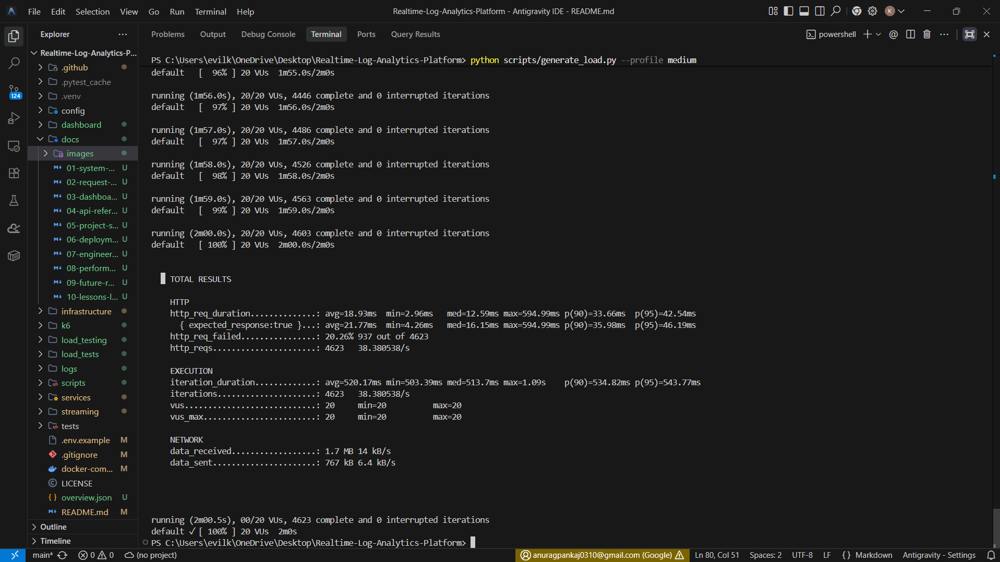
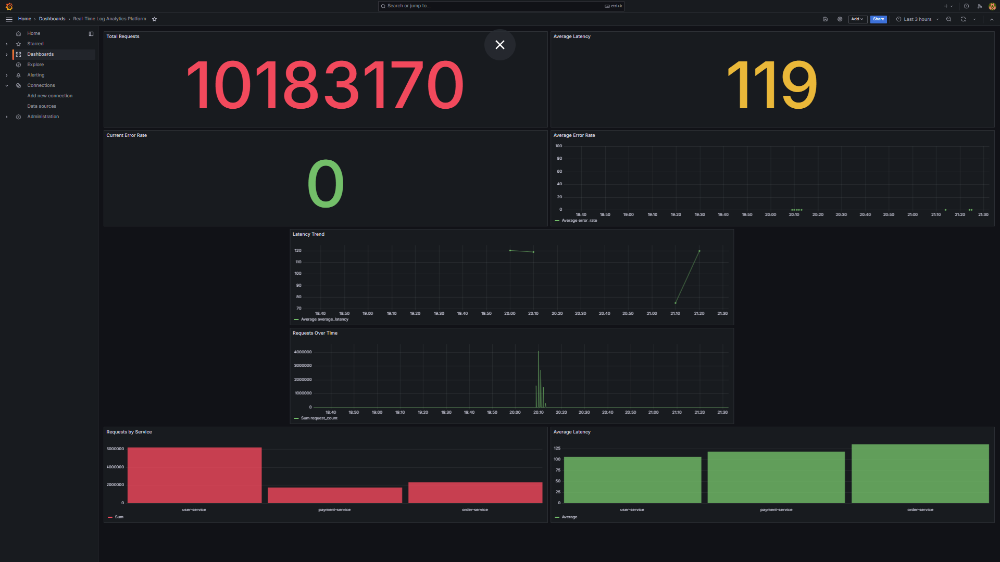
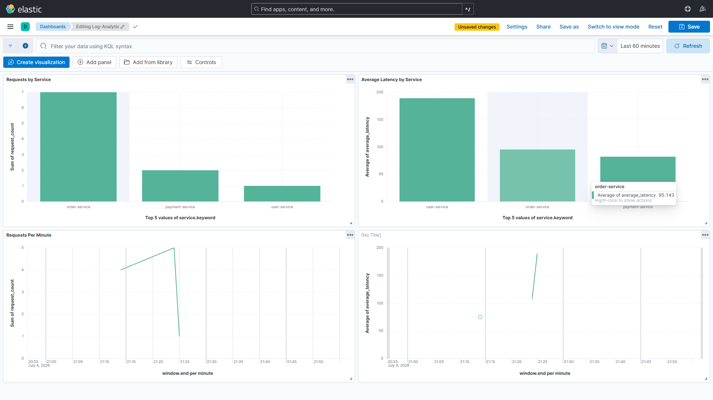

# Performance Testing

## Overview

The load generator (`scripts/generate_load.py`) wraps the `k6` load testing tool via Docker. It sends real HTTP requests to the Nginx API Gateway, which routes them to the FastAPI microservices. These requests generate genuine telemetry that flows through the complete pipeline — Kafka → Spark → Elasticsearch → Dashboard.

There is no simulation or mocking. Every request counted on the dashboard is a real HTTP request that traversed the full stack.

---

## Load Profiles

| Profile | Command | VUs | Duration | Expected RPS |
|---------|---------|-----|----------|-------------|
| Light | `--profile light` | 5 | 30s | 20–50 |
| Medium | `--profile medium` | 20 | 2m | ~38 |
| Heavy | `--profile heavy` | 100 | 3m | 500+ |
| Custom | `--rps N --concurrency N --duration Ns` | user-defined | user-defined | user-defined |

---

## Medium Profile — Results



Results from a real run against the local stack:

| Metric | Result |
|--------|--------|
| Virtual Users | 20 |
| Total Requests | 4,623 |
| Throughput | 38 req/sec |
| P95 Latency | 42 ms |
| Average Latency | 18 ms |
| Avg Iteration Duration | 520 ms |

```bash
# Reproduce
python scripts/generate_load.py --profile medium
```

---

## Grafana Under Load

Container-level impact visible in Grafana during a medium load run. CPU on FastAPI services climbs measurably; Spark shows increased batch processing activity.



Available at: `http://localhost:3001` (admin / admin)

---

## Kibana — Log Volume Under Load

Kibana Discover shows the Elasticsearch index growing in real time as Spark indexes the incoming Kafka events.



Available at: `http://localhost:5601`

---

## Pipeline Reaction Under Load

```
Load generator fires requests
           │
           ▼
Nginx routes to FastAPI services → FastAPI publishes to Kafka (async)
           │
           ▼
Kafka topic lag increases proportional to throughput
           │
           ▼
Spark reads larger micro-batches each trigger interval
           │
           ▼
Spark writes larger bulk index requests to Elasticsearch
           │
           ▼
Analytics API returns higher RPS / latency figures
           │
           ▼
Dashboard charts animate on next poll (5s)
```

---

## Recommended Demo Walkthrough

1. **Open the Dashboard** — show the idle state
2. **Run medium load:** `python scripts/generate_load.py --profile medium`
3. **Overview page** — watch KPI cards update; point out throughput and error rate
4. **Metrics page** — show the time-series chart climbing; explain P95 vs P99 spread
5. **Analytics page** — show traffic distributing across User, Order, Payment services
6. **Logs page** — show the live stream; search for a specific endpoint or error
7. **Kibana** (`localhost:5601`) — show the raw index growing in real time
8. **Grafana** (`localhost:3001`) — show container CPU and memory under load
9. **Kafka UI** (`localhost:8081`) — show topic message rate and consumer group offset

Total demo time with narration: **10–15 minutes**.

---

## Light Profile

**Configuration:** 5 virtual users, 30-second duration  
**Purpose:** Quick sanity check that telemetry is flowing end-to-end  
**Expected:** Slow trickle in Logs page; KPI cards show non-zero values

---

## Heavy Profile

**Configuration:** 100 virtual users, 3-minute duration  
**Purpose:** Stress testing  
**Expected:** P99 latency spikes on Metrics page; Kafka lag builds as Spark struggles to keep pace; potential OOM on machines under 16 GB RAM

---

## Performance Limitations

- **Host RAM** is the primary bottleneck on local Docker deployments (Kafka + Spark + Elasticsearch each need 1–2 GB JVM heap)
- **Single Kafka partition** limits throughput linearly
- **Spark micro-batch** introduces 1–3s floor latency between event and dashboard
- **5-second polling** means dashboard freshness is bounded by the interval
